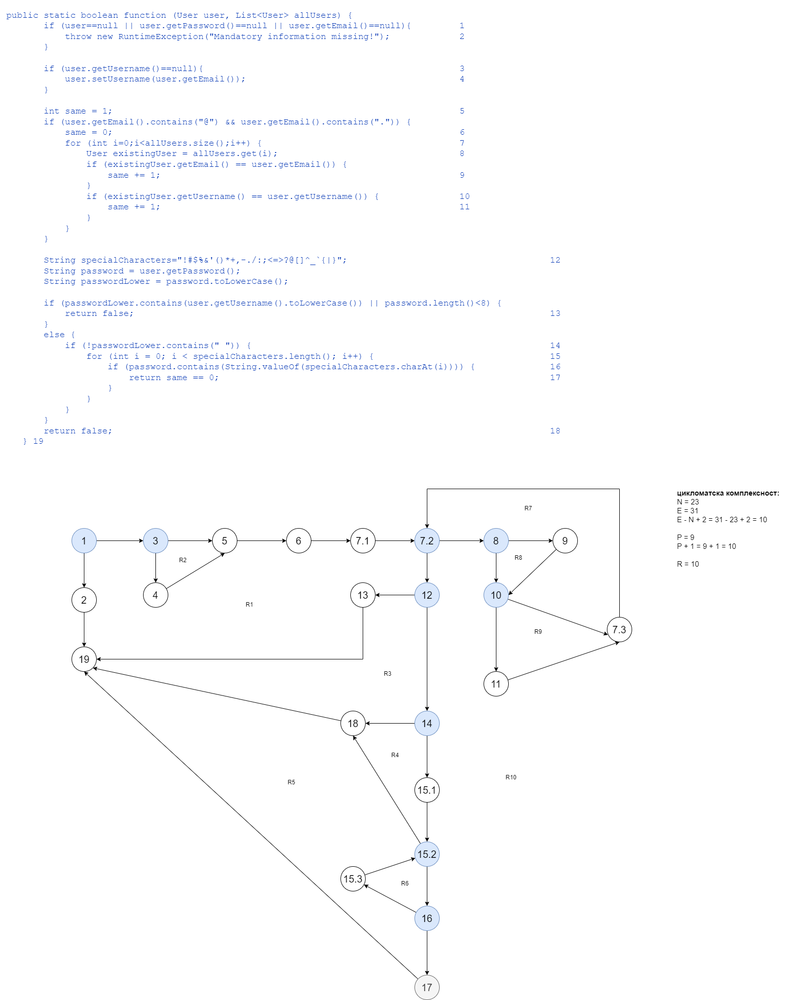

# Втора лабораториска вежба по Софтверско инженерство

## Кристијан Ристовски, бр. на индекс 90810

###  Control Flow Graph

Фотографија од control flow graph-ot 

### Цикломатска комплексност

Цикломатската комплексност на овој код е 10, истата ја добив преку формулата P+1, каде што P е бројот на предикатни јазли. Во случајoв P=9, па цикломатската комплексност изнесува 10. Или преку региони, каде бројот на региони е 10.

### Тест случаи според критериумот  Every statement 

....

### Тест случаи според критериумот Multiple condition

TXX - User user = null;
FTX - User user = new User(
		"username",
		null,
		"Kristijan@finki.com");
FFT - User user = new User(
		"username",
		"password",
		null);
FFF - User user = new User (
		"username",
		"password",
		"Kristijan@finki.com");

### Објаснување на напишаните unit tests

Multiple Condition:
Имаме вкупно 4 тест случаеви каде што во првите 3 тест случаеви очекуваме RuntimeException со порака: "Mandatory information missing!" а во четвртиот не очекуваме RuntimeException. Во првиот тест имаме user = null, и веднаш се очекува RuntimeException. Во вториот тест правиме нов user но password = null ---> RuntimeException. Во третиот тест имаме user и password но email = null ---> RuntimeException. Во четвртиот тест ги има задоволено сите критериуми и веќе не очекуваме RuntimeException.

